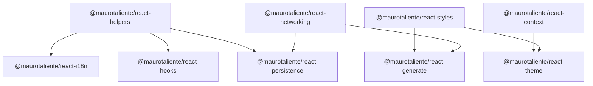

# Architecture and boundaries

## What this monorepo is for

A **shared toolkit** for React apps (internal products, demos, or greenfield UIs): typed design tokens from CSS, HTTP clients + hooks, browser persistence, i18n helpers, and small React primitives (`context`, `theme`). It is **not** a full application framework, a design system with ready-made components, or a drop-in replacement for full-stack i18n servers (ICU is supported for messages; routing/locale negotiation stays app-specific).

**In scope:** accelerate consistent patterns (codegen, optional shared `RequestCache` on `useAsyncFetch`, one in-flight request per hook instance by default, tokens aligned with Tailwind v4-style CSS).

**Out of scope (today):** a third-party query library wired in for you, or a component library.

## Package map (dependency direction)

Apps consume only what they need; `workspace:*` keeps versions aligned.

## SSR / client / server matrix

Use this to pick the right entry and avoid importing client-only code into RSC or server bundles.

| Package | Safe in RSC / server layout | Client components (`'use client'`) | Notes |
|---------|----------------------------|-----------------------------------|--------|
| `@maurotaliente/react-helpers` | Yes | Yes | Pure JS utilities |
| `@maurotaliente/react-context` | No (React context) | Yes | Uses client-only context |
| `@maurotaliente/react-styles` | Yes (types, `buildStyles`, tokens) | Yes (`useBuildStyles`, `useCssVariable` in `styles.client`) | Generated `styles` import is app code |
| `@maurotaliente/react-networking` | Yes: `request`, `createApiRegistry`, `fetch.server` | Yes: `useAsyncFetch`, `fetch.client` | Do not import `fetch.client` / hooks in server files |
| `@maurotaliente/react-persistence` | Yes: `http-auth-load`, cookie store helpers without hooks | Yes: `*.client.tsx` hooks | Hooks wrap `useAsyncFetch` |
| `@maurotaliente/react-hooks` | Only hooks that do not touch `window` if you know usage | Yes | `next-route-query` needs Next client |
| `@maurotaliente/react-i18n` | Yes: `getLocale`, `browser` (with injected APIs in tests) | Yes: `@maurotaliente/react-i18n/next` (`next.client`) | `@maurotaliente/react-i18n/next/server` for server-only loaders |
| `@maurotaliente/react-theme` | Provide `value` from server; DOM helpers are no-ops if `document` missing | Yes: `createThemeRuntime` | See package README for SSR patterns |

**Rule of thumb:** anything under a `*.client.tsx` file or re-exported from `fetch.client` is **browser + React client** only.

## React context and re-renders

`@maurotaliente/react-context` exposes **`newContext`** with **separate** `StateContext` and `DispatchContext` so updates to the dispatcher identity stay stable. That avoids one common pitfall, but **any hook that reads the full state still re-renders when any slice of that state changes**—React has no built-in “selector” API for context.

**Practical patterns:**

- Prefer **narrow subscriptions**: derive only what a component needs (e.g. `useMemo` over `useXState()` for one field, or small child components that read a single field).
- For hot trees, **split state** into multiple providers or multiple context pairs so leaves do not subscribe to unrelated slices.
- **Do not** assume that splitting dispatch from state alone prevents re-renders on every dispatch; consumers that call the state hook still see the full store.

See [@maurotaliente/react-context README](../packages/context/README.en.md) for a minimal selector-style example.

## Recommended conventions: loading / error / success

These are **documentation defaults**; the APIs stay flexible.

### `useAsyncFetch` (and generated `use*Request`)

- **`initialLoading`:** use for first-load skeletons (`loading && meta.success === 0`).
- **`loading`:** any in-flight request for this hook instance.
- **`data`:** last successful mapped payload (via `setter`).
- **`error`:** thrown error or failed HTTP handling; check `error instanceof Error` for messages.
- **`meta`:** triggers, successes, retries—use for debugging or UI guards.

Do not rely on **`status`** alone after a successful cycle; the hook may reset it internally—prefer **`data`** and **`meta.success`**.

### Persistence hooks (`useGetLocal`, etc.)

Treat them like `useAsyncFetch`: `loading`, `error`, `data` (stored value). Initial read may flash empty until storage resolves—use `initData` where provided.

## Opt-in request cache (`createRequestCache`)

`useAsyncFetch` runs **`action`** (which typically calls your generated `apis.*` client). That is the right layer for caching—not a generic `fetch` wrapper.

- Pass **`requestCache: 'global'`** for the shared process cache (no import), or a **`RequestCache`** instance from **`createRequestCache()`** when you need a dedicated store (e.g. tests, a feature-scoped cache), plus optional **`cacheTtlMs`** on `DynamicOptions`. Keys default to `name` + `params` + optional `scope`; override with **`cacheKey`**.
- **`cacheTtlMs` omitted or `0`:** only **deduplicate in-flight** calls sharing the same key (no memory of past responses).
- **`cacheTtlMs` &gt; 0:** keep the last **successful** `RequestReturn` (HTTP 2xx) in memory until expiry. Call **`invalidate(key)`** on the cache instance when you need to drop entries.
- This is **not** a replacement for server-side HTTP caches or for a full query/invalidation graph; it complements `useAsyncFetch` when multiple components may request the same payload.
- **Cross-tab:** if another tab mutates shared server state, listen to `window` `storage` (or your own channel) and call **`defaultRequestCache.invalidate(key)`** (or your custom instance)—optional pattern, not built-in.

## Escape hatches

- **Networking:** use `request` / raw `fetch` alongside `createApiRegistry`; pass custom `action` in `useAsyncFetch` without using generated hooks. Use `mergeRequestProps` for headers without the full registry.
- **Theme:** pass `value` and `onThemeChange` only; swap persistence implementation inside `onThemeChange` (cookie, server action, etc.).
- **i18n:** keep dictionaries as plain objects; `getLocale` does not require Next—swap `resolveInitialLocale` for your own bootstrap.
- **Persistence:** use `createStorageApi` with a custom `Storage` or test double; auth loaders are optional wrappers around `LoadRequestProps`.

## TypeScript entry points

For which types to import from `@maurotaliente/react-networking`, `@maurotaliente/react-persistence`, and related packages, see [typescript.en.md](typescript.en.md).

## Versioning (workspace)

All `@maurotaliente/react-*` packages use **0.0.x** in lockstep for now. Breaking changes should be noted in [CHANGELOG.md](../CHANGELOG.md) with migration hints. When publishing to npm independently, align minor bumps across packages that share types.

## Performance expectations

- **Networking:** one logical in-flight request per `useAsyncFetch` **instance** (last trigger wins). For parallel hook instances, optionally use the same **`requestCache: 'global'`** (or the same custom **`RequestCache`** reference) to dedupe/TTL across instances with the same key; otherwise use **multiple hook instances** without a shared cache.
- **Bundle:** import from package entry points; tree-shaking depends on your bundler. Heavy features (e.g. wide `helpers`)—import only what you use from `@maurotaliente/react-helpers`.

See [performance.en.md](performance.en.md) for a short rationale and when to add another data library.
